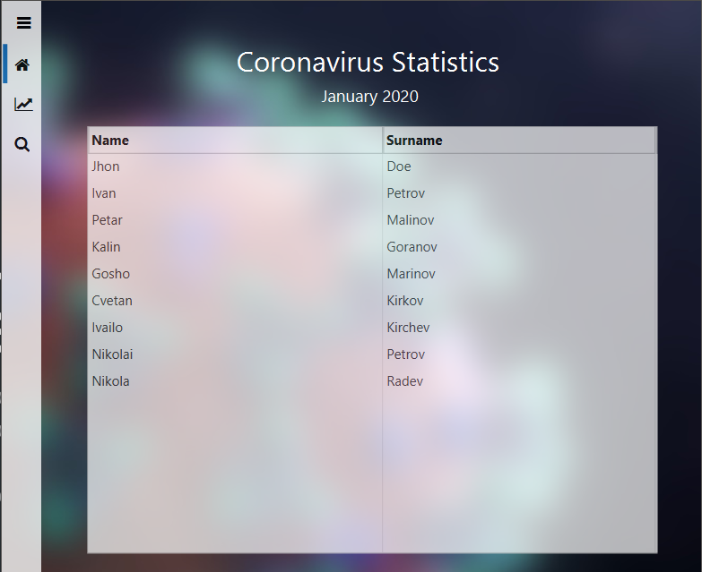
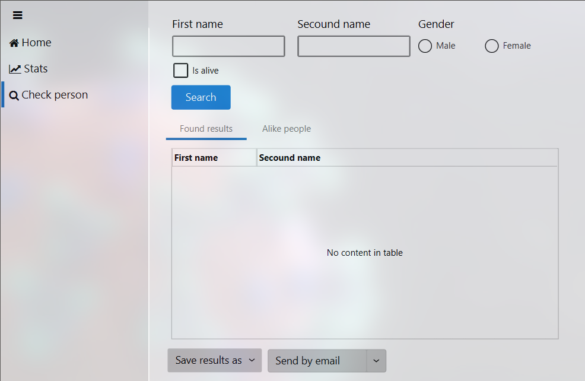
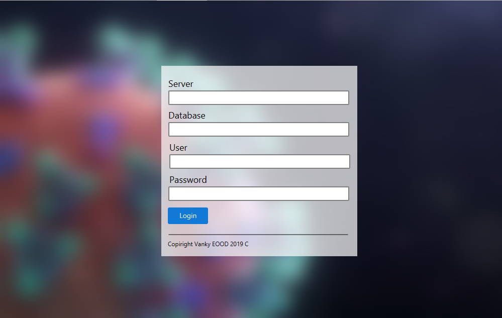

    

    

## FluentFX - Fluent design for javafx *STILL WORK IN PROGRESS*

FluentFX is a project that takes take of javafx "front-end" side.

# Demo application

Demo application I am workin on.

Demo application for coronavirus statistics.

### Working on

*For the next commit

<ul>
<li>Input groups</li>
<li>Fluent icon pack</li>
<li>Fonts</li>
</ul>

MenuBar

### What's new

<ul>
<li>Navigation view</li>
<li>Data grid</li>
<li>Demo application changes</li>
</ul>
