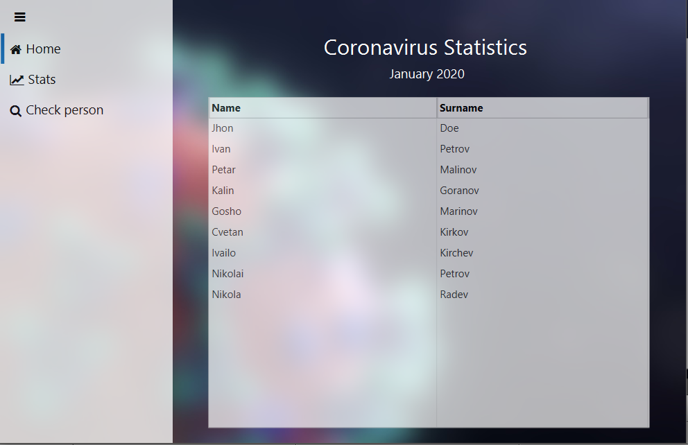

    

    
    

## FluentFX - Fluent design for javafx

# Demo application

Demo application I am workin on. Next commit going to create a navigation view helper. The navigation view styles are ready themselfs. The demo works with controlsfx for icons. The theme is evolving to a full library. You can run the demo by cloning the repo and "mvn javafx:run" the demo-maven folder.

Demo application for coronavirus statistics.

### Working on

*For the next commit

<ul>
<li>Input groups</li>
<li>Fluent icon pack</li>
<li>Fonts</li>
</ul>

MenuBar

### What's new

<ul>
<li>Navigation view</li>
<li>Data grid</li>
<li>Demo application</li>
</ul>
