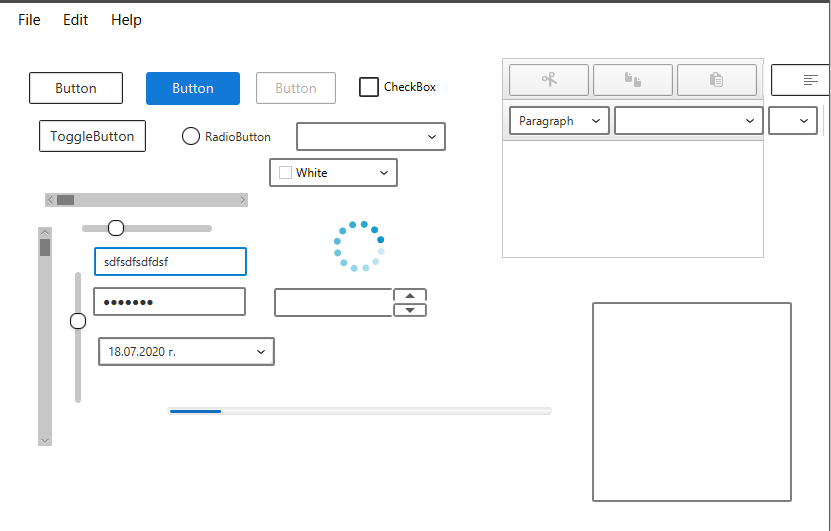

    

    
    
    

## FluentFX - Fluent design for javafx

# NEW LOOK AND FEEL

Simple css file for fluent design in javafx

MenuBar

### What's new
Experimental new look 

Migrating to the web controls - https://developer.microsoft.com/en-us/fluentui#/controls/
